# Macroevolutionary analysis with microevolutionary priors
This tutorial will guide you through the use of soon to be released bayou v2.0. The goal of bayou
is to fit Ornstein-Uhlenbeck models to phylogenies without a priori hypotheses about regime placement. 
bayou v2.0 adds flexibility for implementation of customized models. 
First, let's install and load the R packages we will use for this exercise:


```r
devtools::install_github("uyedaj/bayou", ref="dev")
install.packages("treeplyr")
```


```r
library(bayou)
library(treeplyr)
```

# Preparing data for analysis with the R package treeplyr.
We will use data from the Species 360 database of normal animal reference ranges for a variety of 
traits (formerly known as the International Species Information System = ISIS). The data file has
been slightly modified here, but the original data file is available at: 
http://www2.isis.org/support/MEDARKS/Pages/Reference%20Ranges.aspx

```r
sp360 <- readRDS("../data/species360.rds")
tbl_df(sp360)
```

```
## # A tibble: 2,299 x 259
##                    SPECIES ALANINEAMINOTRANSFERASE ALBUMIN_COLORIMETRY
##                      <chr>                   <dbl>               <dbl>
## 1           Aburria_pipile                      13                 1.5
## 2         Acanthis_flammea                     NaN                 NaN
## 3     Acanthochelys_spixii                      10                 NaN
## 4  Acanthophis_antarcticus                     NaN                 NaN
## 5   Acanthosaura_crucigera                     NaN                 1.2
## 6       Accipiter_cooperii                      52                 1.4
## 7          Aceros_cassidix                      40                 1.8
## 8        Aceros_corrugatus                      27                 1.7
## 9     Aceros_leucocephalus                     NaN                 1.9
## 10        Acinonyx_jubatus                     103                 3.5
## # ... with 2,289 more rows, and 256 more variables:
## #   ALBUMIN_ELECTROPHORESIS <dbl>, ALKALINEPHOSPHATASE <dbl>,
## #   ALPHA1GLOBULIN_ELECTROPHORESIS <dbl>,
## #   ALPHA2GLOBULIN_ELECTROPHORESIS <dbl>,
## #   ALPHAGLOBULIN_ELECTROPHORESIS <dbl>, AMYLASE <dbl>,
## #   ASPARTATEAMINOTRANSFERASE <dbl>, AZUROPHILS <dbl>, BASOPHILS <dbl>,
## #   BETAGLOBULIN_ELECTROPHORESIS <dbl>, BICARBONATE <dbl>,
## #   BLOODUREANITROGEN <dbl>, BodyTemperature <dbl>, CALCIUM <dbl>,
## #   CARBONDIOXIDE <dbl>, CHLORIDE <dbl>, CHOLESTEROL <dbl>,
## #   CORTISOL <dbl>, CREATINEPHOSPHOKINASE <dbl>, CREATININE <dbl>,
## #   DIRECTBILIRUBIN <dbl>, EOSINOPHILS <dbl>,
## #   ERYTHROCYTESEDIMENTATIONRATE <dbl>, ESTROGEN <dbl>, FIBRINOGEN <dbl>,
## #   FREETRIIODOTHYRONINE <dbl>, GAMMAGLOBULIN_ELECTROPHORESIS <dbl>,
## #   GAMMAGLUTAMYLTRANSFERASE <dbl>, GLOBULIN_COLORIMETRY <dbl>,
## #   GLUCOSE <dbl>, HEMATOCRIT <dbl>, HEMOGLOBIN <dbl>, HETEROPHILS <dbl>,
## #   HIGHDENSITYLIPOPROTEINCHOLESTEROL <dbl>, INDIRECTBILIRUBIN <dbl>,
## #   IRON <dbl>, LACTATEDEHYDROGENASE <dbl>, LEAD <dbl>, LIPASE <dbl>,
## #   LOWDENSITYLIPOPROTEINCHOLESTEROL <dbl>, LYMPHOCYTES <dbl>,
## #   MAGNESIUM <dbl>, MCH <dbl>, MCHC <dbl>, MCV <dbl>, MONOCYTES <dbl>,
## #   NEUTROPHILICBANDS <dbl>, NUCLEATEDREDBLOODCELLS <dbl>,
## #   OSMOLARITY <dbl>, PHOSPHORUS <dbl>, PLATELETCOUNT <dbl>,
## #   POTASSIUM <dbl>, PROGESTERONE <dbl>, REDBLOODCELLCOUNT <dbl>,
## #   RETICULOCYTES <dbl>, SEGMENTEDNEUTROPHILS <dbl>, SODIUM <dbl>,
## #   TESTOSTERONE <dbl>, TOCOPHEROL <dbl>, TOCOPHEROL,ALPHA <dbl>,
## #   TOCOPHEROL,GAMMA <dbl>, TOTALBILIRUBIN <dbl>,
## #   TOTALPROTEIN_COLORIMETRY <dbl>, TOTALPROTEIN_REFRACTOMETER <dbl>,
## #   TOTALTHYROXINE_RIA <dbl>, TOTALTRIIODOTHYRONINE_RIA <dbl>,
## #   TRIGLYCERIDE <dbl>, TRIIODOTHYRONINEUPTAKE <dbl>, URICACID <dbl>,
## #   Weight_01daysage <dbl>, Weight_0.91.1monthsage <dbl>,
## #   Weight_0.91.1yearsage <dbl>, Weight_1.41.6yearsage <dbl>,
## #   Weight_14.515.5yearsage <dbl>, Weight_1.82.2monthsage <dbl>,
## #   Weight_1.82.2yearsage <dbl>, Weight_19.021.0yearsage <dbl>,
## #   Weight_2.73.3monthsage <dbl>, Weight_2.73.3yearsage <dbl>,
## #   Weight_4.55.5yearsage <dbl>, Weight_5.46.6monthsage <dbl>,
## #   Weight_68daysage <dbl>, Weight_9.510.5yearsage <dbl>,
## #   WHITEBLOODCELLCOUNT <dbl>, ALANINEAMINOTRANSFERASE.SD <dbl>,
## #   ALBUMIN_COLORIMETRY.SD <dbl>, ALBUMIN_ELECTROPHORESIS.SD <dbl>,
## #   ALKALINEPHOSPHATASE.SD <dbl>, ALPHA1GLOBULIN_ELECTROPHORESIS.SD <dbl>,
## #   ALPHA2GLOBULIN_ELECTROPHORESIS.SD <dbl>,
## #   ALPHAGLOBULIN_ELECTROPHORESIS.SD <dbl>, AMYLASE.SD <dbl>,
## #   ASPARTATEAMINOTRANSFERASE.SD <dbl>, AZUROPHILS.SD <dbl>,
## #   BASOPHILS.SD <dbl>, BETAGLOBULIN_ELECTROPHORESIS.SD <dbl>,
## #   BICARBONATE.SD <dbl>, BLOODUREANITROGEN.SD <dbl>,
## #   BodyTemperature.SD <dbl>, CALCIUM.SD <dbl>, ...
```

The tree file we are using is a mashup of several trees spliced together that includes 29,301 species of
vertebrate. First we're going to make sure we resolve polytomies and set zero length branches to some 
small value. 

```r
tree <- read.tree("../data/tetrapods.tre")
tree <- multi2di(tree, random=FALSE)
tree$edge.length[tree$edge.length==0] <- .Machine$double.eps
```

Matching the tree to the data is easy and fast in treeplyr, simply use the command make.treedata(). The 
resulting list includes a pruned tree 'phy' and a pruned data table in the same order as the tree 'dat':

```r
td <- make.treedata(tree, sp360)
```

Let's choose a trait to study. In this case, let's use Weight from 1.8-2.2 years old (this isn't the best
dataset for body size, but we'll use it for now).

```r
tdW <- filter(td, !is.na(Weight_1.82.2yearsage) & Weight_1.82.2yearsage > 0) %>% 
  mutate(., lnMass = log(Weight_1.82.2yearsage), lnMass.SD = Weight_1.82.2yearsage.SD/Weight_1.82.2yearsage,N = Weight_1.82.2yearsage.N) %>%
  dplyr::select(., lnMass, lnMass.SD, N)
```

Visualize the trait on the tree (always do this!!)

```r
phenogram(tdW$phy, tdW[['lnMass']], spread.labels=FALSE, fsize=0.4)
```

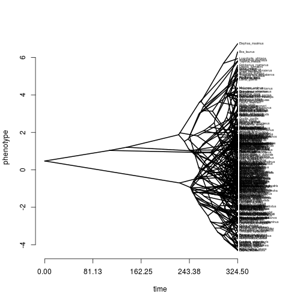

Run a bayou analysis by first setting up a prior distribution for parameters. Let's split up the data frame now
that everything is order and make our prior distribution.

```r
tree <- tdW$phy
dat <- tdW[[1]]
ME <- tdW[['lnMass.SD']]/sqrt(tdW[['N']])

priorOU <- make.prior(tree, 
                      dists=list(dalpha="dhalfcauchy", dsig2="dhalfcauchy", 
                                 dk="cdpois", dtheta="dnorm"),
                        param=list(dk=list(lambda=15, kmax=200), dsb=list(bmax=1, prob=1), 
                                   dtheta=list(mean=mean(dat), sd=1.5*sd(dat)))
                     )
```

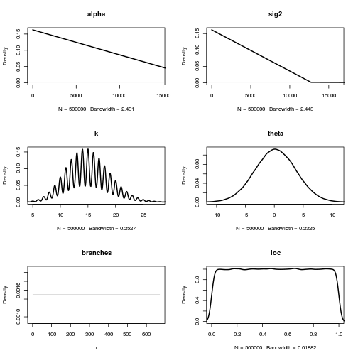

We can simulate some values from the prior distribution to test to make sure our prior function works.

```r
startpars <- priorSim(priorOU, tree, plot=TRUE)$pars[[1]]
```

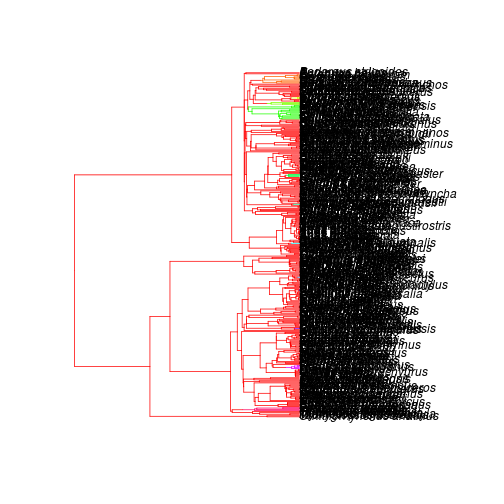

```r
priorOU(startpars)
```

```
## [1] -104.5195
```

Now that we have a prior function, let's build an MCMC object that will help us run our analyses.

```r
set.seed(1)
mcmcOU <- bayou.makeMCMC(tree, dat, SE=ME, prior=priorOU, new.dir="../output/runs/modelOU/", outname="modelOU_r001", plot.freq=NULL)
```

To run the analysis, use the 'run' function in the mcmcOU object and specify the number of generations. 
If this amount of generations is insufficient, the MCMC chain will restart from its previous point (as long as
the output files have not been removed.)

```r
mcmcOU$run(10000)
```

```
## gen     lnL     prior   alpha   sig2    rtheta  k       .alpha  birth.k D0.slid D1.slid death.k .sig2   .theta  U0.slid U1.slid U2.slid 
## 1000    -687.70 -136.36 0.99    7.79    0.37    18      0.27    0.03    1.00    0.36    0.77    0.23    0.76    1.00    0.57    0.46    
## 2000    -603.67 -137.66 1.42    6.35    -0.49   18      0.26    0.02    0.98    0.37    0.76    1.00    0.20    0.73    1.00    0.45    0.40    
## 3000    -556.95 -154.74 3.25    10.20   0.96    21      0.24    0.02    0.99    0.39    0.72    1.00    0.20    0.72    1.00    0.38    0.39    
## 4000    -535.82 -161.38 5.26    15.55   0.91    22      0.24    0.02    0.99    0.40    0.63    1.00    0.22    0.70    1.00    0.25    0.24    
## 5000    -540.18 -161.39 8.53    23.94   0.63    22      0.25    0.02    0.99    0.39    0.58    0.86    0.22    0.67    1.00    0.21    0.22    
## 6000    -536.50 -149.33 5.14    13.41   0.42    20      0.24    0.02    0.99    0.43    0.58    0.89    0.22    0.66    1.00    0.18    0.23    
## 7000    -531.11 -124.80 3.87    10.91   -0.07   16      0.25    0.02    0.99    0.41    0.57    0.90    0.22    0.64    1.00    0.16    0.24    
## 8000    -507.24 -156.12 4.53    10.09   -0.07   21      0.24    0.02    0.99    0.40    0.52    0.90    0.23    0.63    1.00    0.13    0.21    
## 9000    -530.83 -143.90 3.74    10.11   -0.21   19      0.24    0.01    0.99    0.38    0.51    0.90    0.24    0.62    1.00    0.13    0.20    
## 10000   -533.58 -119.32 4.10    11.37   -0.15   15      0.25    0.01    0.99    0.39    0.51    0.90    0.24    0.61    0.99    0.12    0.18
```

Load the chain back into R and clean up the output files, saving the chain as an RDS file. 

```r
chainOU <- mcmcOU$load(saveRDS=TRUE, cleanup=TRUE)
```

```
## file saved to ../output/runs/modelOU///modelOU_r001.chain.rds
```

Set the burnin proportion for plotting with coda to check the MCMC chains

```r
chainOU <- set.burnin(chainOU, 0.3)
summary(chainOU)
```

```
## bayou MCMC chain: 10000 generations
## 1001 samples, first 300 samples discarded as burnin
```

```
## Warning in rbind(statistics, c(sum.rjpars[[i]]$statistics[1:2], rep(NA, :
## number of columns of result is not a multiple of vector length (arg 2)
```

```
## 
## 
## Summary statistics for parameters:
##                    Mean         SD   Naive SE Time-series SE
## lnL        -532.9472845 11.4312747 0.43144566      6.2537627
## prior      -146.3337814 12.0564989 0.45504323      5.0758750
## alpha         4.9054029  1.3451111 0.05076795      0.4146434
## sig2         13.6115914  3.8928516 0.14692622      1.5234124
## k            19.4829060  2.0224471 0.07633235      0.8667291
## ntheta       20.4829060  2.0224471 0.07633235      0.8667291
## root.theta    0.1058022  0.4114046 0.01552747      0.1665544
## all theta     1.0208560  2.3732706         NA             NA
##            Effective Size   HPD95Lower   HPD95Upper
## lnL              3.341231 -560.3608396 -513.6343952
## prior            5.641838 -167.7538156 -125.0146441
## alpha           10.523659    3.1939646    7.8009950
## sig2             6.529813    7.9557234   21.0611904
## k                5.444871   16.0000000   23.0000000
## ntheta           5.444871   17.0000000   24.0000000
## root.theta       6.101351   -0.2202896    0.9135595
## all theta              NA    1.0208560    2.3732706
## 
## 
## Branches with posterior probabilities higher than 0.1:
##            pp magnitude.of.theta2 naive.SE.of.theta2 rel.location
## 218 1.0000000         -3.35687695        0.005393977 1.194911e-01
## 275 1.0000000         -1.57514890        0.007297555 4.310465e-03
## 637 1.0000000          3.91884164        0.009529892 9.749762e-01
## 642 0.9572650          1.83449905        0.025993365 2.780579e-01
## 638 0.9415954          3.89182623        0.043637736 1.518956e+00
## 660 0.9387464          4.90922610        0.022240260 1.115118e+00
## 565 0.8390313          4.75509737        0.028141367 2.671815e-02
## 388 0.7991453          2.36130213        0.016090889 4.144798e-01
## 100 0.7179487          0.75084446        0.017275773 1.785986e+01
## 99  0.6837607          1.97300736        0.028091569 1.300493e+00
## 588 0.5641026         -2.65031946        0.060715710 5.057097e-01
## 448 0.5384615          1.79410113        0.015700013 8.539806e-01
## 440 0.4928775         -0.99606557        0.016202051 2.207369e-01
## 509 0.3660969          3.43172656        0.016707489 1.116112e+00
## 452 0.3532764          0.42737528        0.029308828 1.873375e-01
## 640 0.3461538         -2.08587823        0.058708354 1.286293e+00
## 378 0.3304843         -1.34835400        0.048940958 6.484344e-01
## 11  0.3190883         -0.84480740        0.029912830 2.081700e+00
## 148 0.3162393          1.28799379        0.021634775 4.924924e-02
## 573 0.3133903          0.01972103        0.080190617 9.444932e-02
## 83  0.2991453         -1.28074913        0.026399372 2.564750e+00
## 584 0.2948718          2.94448703        0.033359672 3.304484e-01
## 383 0.2877493          0.69225989        0.037833191 2.385303e+00
## 566 0.2834758          1.09703952        0.019741703 1.902306e-01
## 670 0.2806268         -0.12494469        0.003723604 1.761701e+00
## 669 0.2720798          0.53366024        0.013639142 1.016903e+00
## 659 0.2663818          1.74025732        0.025600680 4.597810e-01
## 373 0.2592593          2.31190893        0.027459964 1.835646e+01
## 510 0.2507123          4.17401798        0.026856751 6.618392e-01
## 582 0.2222222          1.00404697        0.008417490 1.727275e+00
## 41  0.2022792          0.95445842        0.036716159 3.529239e-01
## 67  0.1880342         -1.30093890        0.025869003 1.032548e+00
## 451 0.1823362         -0.33708687        0.041325095 5.916612e+00
## 228 0.1794872         -1.23125774        0.039849858 3.886375e-01
## 374 0.1723647          2.57527929        0.026815870 4.379334e+00
## 109 0.1652422         -0.62373014        0.038717518 3.187044e+00
## 357 0.1652422          1.53333498        0.072176163 1.160012e+02
## 527 0.1566952          3.12064343        0.030333113 8.062767e+01
## 664 0.1495726          0.05762406        0.021644498 6.723867e+00
## 450 0.1452991          0.76047884        0.052459032 1.532642e-01
## 459 0.1381766         -0.54439921        0.029465367 7.011424e+00
## 462 0.1210826         -0.84497023        0.025768953 5.243179e-02
## 333 0.1153846          0.16593947        0.064784600 4.765326e-01
## 528 0.1153846          0.91539018        0.036051437 2.114233e-01
## 661 0.1082621          2.69090638        0.094111631 2.437446e-01
## 454 0.1068376          0.05841841        0.051906823 2.088461e-01
## 205 0.1039886         -3.22133169        0.039111039 7.061690e-02
## 449 0.1025641          0.64069831        0.038535005 3.214141e-01
```

```r
plot(chainOU)
```

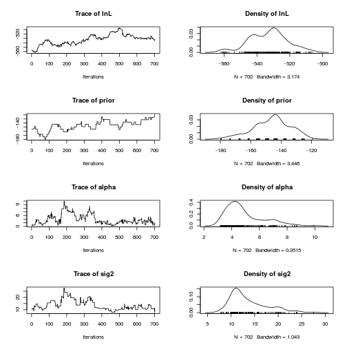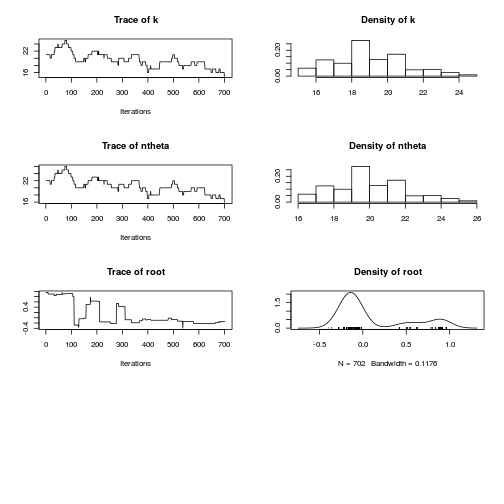

## Visualization
Visualizing a tree this large is difficult on a screen as small as ours, so let's output the file to a pdf with
larger dimensions, so that we can read the tip labels. 

```r
pdf("../output/runs/modelOU/ModelOUHeatMap.pdf", height=20, width=8)
```

```r
#Posterior probabilities proportional to circle diameter:
plotSimmap.mcmc(chainOU, burnin=0.3, cex=0.5)
```

```
## Warning in plotSimmap.mcmc(chainOU, burnin = 0.3, cex = 0.5): Length of
## post-burnin sample less than the requested parameter sample, using entire
## post-burnin chain instead
```

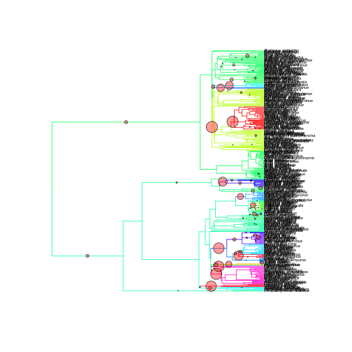

```r
#Branch color proportional to posterior mode value for theta
plotBranchHeatMap(tree, chainOU, variable="theta", burnin=0.3, cex=0.5, lwd=2)
```

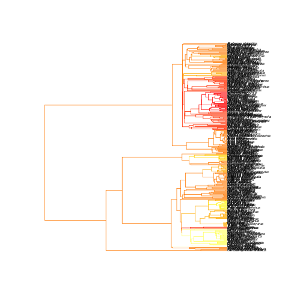

```r
#Phenogram with branches with posterior probabilities > 0.3 colored and a density plot of the posterior of all thetas:
phenogram.density(tree, dat, burnin=0.3, chainOU, pp.cutoff=0.3)
```

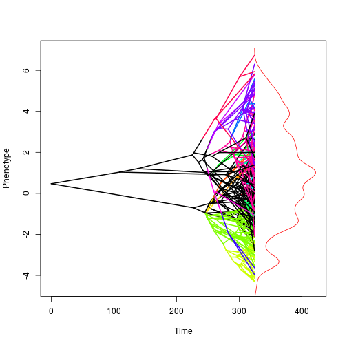

```r
dev.off()
```


```r
pdf("../output/runs/modelOU/ShiftSummaries.pdf", height=8, width=8)
```

```r
shiftsumOU <- shiftSummaries(chainOU, mcmcOU, pp.cutoff=0.5)
plotShiftSummaries(shiftsumOU)
```

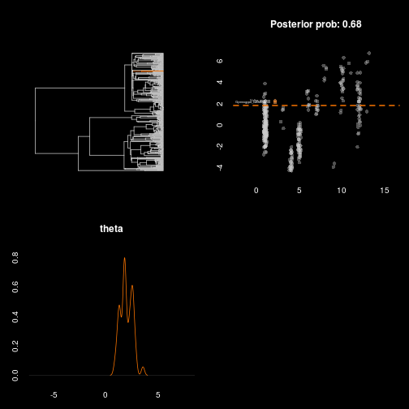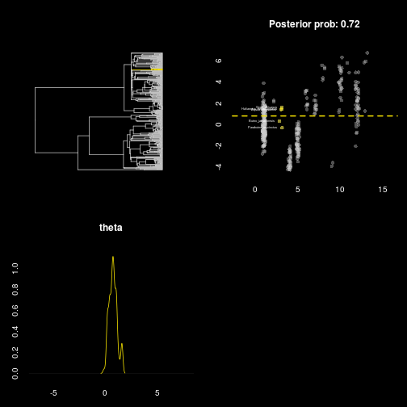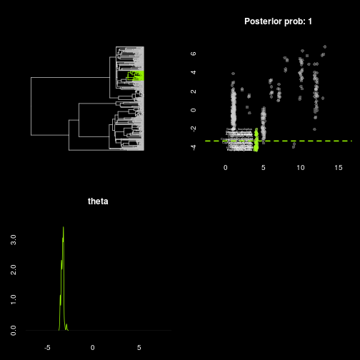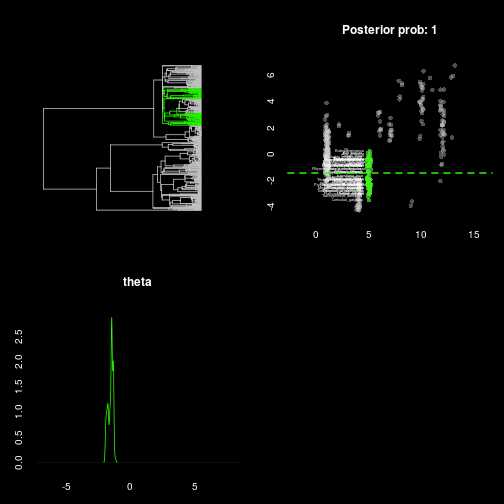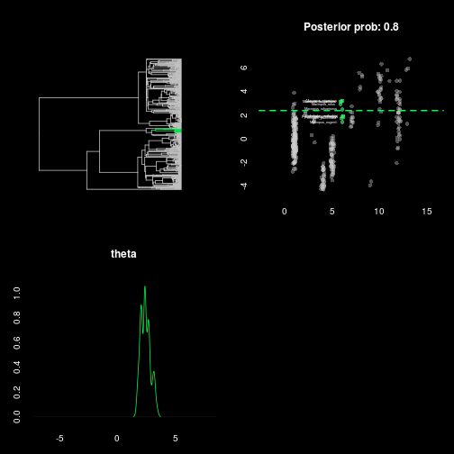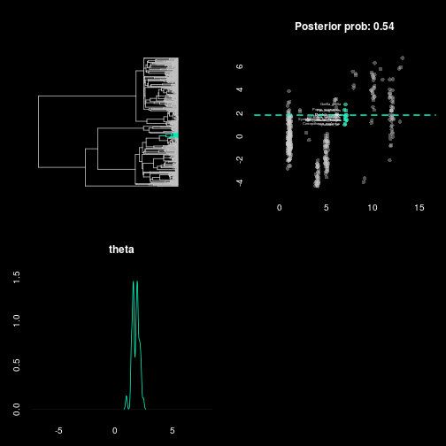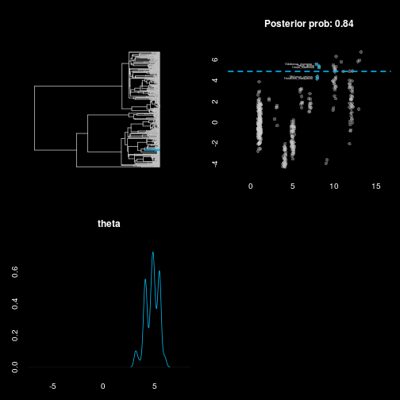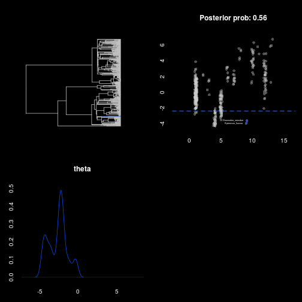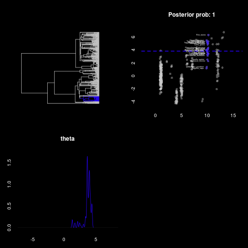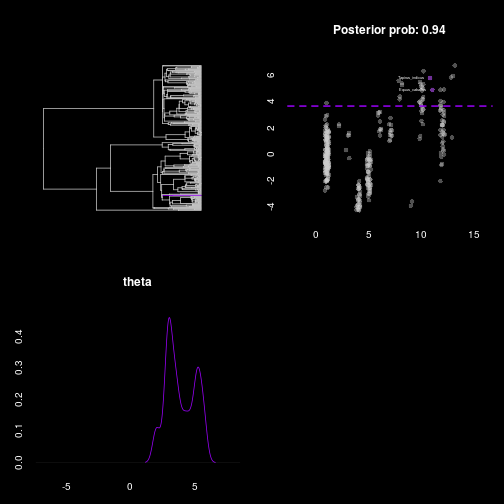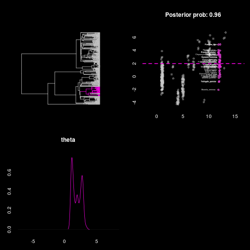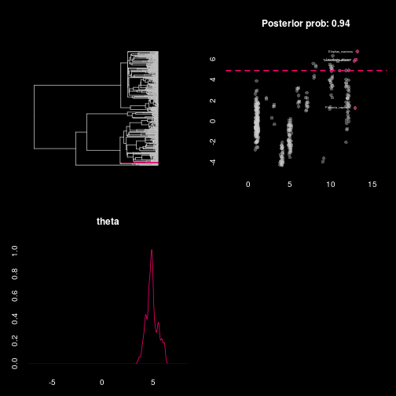

```r
dev.off()
```

Or you can plot samples from the posterior distribution:

```r
par(mfrow=c(3,3))
for(i in seq(floor(0.3*length(chainOU$gen)), length(chainOU$gen), length.out=9)){
  samplepars <- pull.pars(i, chainOU, model=mcmcOU$model.pars)
  tr <- pars2simmap(samplepars, tree)
  plotRegimes(tr$tree, pal=rainbow, lwd=2, type="phylogram", direction="upwards", show.tip.label=FALSE)
}
```

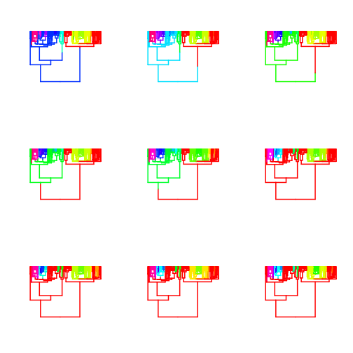

```r
par(mfrow=c(1,1))
```

# Alternative parameterizations
Two alternative parameterizations of the OU model are built into bayou. First, is a parameterization where 
priors can be placed directly on phylogenetic half-life and stationary variance, rather than alpha and sigma^2.
For example, let's say we want to have a mildly informative prior on the phylogenetic half-life--say a log-normal
distribution:

```r
par.halflife <- list(meanlog=3, sdlog=2.5)
#Draw a bunch of samples from this distribution:
samp <- rlnorm(10000, par.halflife$meanlog, par.halflife$sdlog)
hist(log(samp,10), breaks=100)
abline(v=log(c(1,max(branching.times(tree))),10), col="red", lwd=2, lty=2)
```

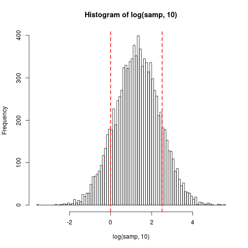
Notice that there is about equal density of prior probability on the half-life being greater than tree height (rightmost
red line) as there is below 1 million years (leftmost red line). The exact quantiles of this distribution are:

```r
qlnorm(c(0.025, 0.25, 0.5, 0.75, 0.975), meanlog=par.halflife$meanlog, sdlog=par.halflife$sdlog)
```

```
## [1]    0.1495821    3.7201933   20.0855369  108.4429660 2697.0394795
```

Second, we'll set the prior on the stationary variance of the OU process from the Blunderbuss model, as this seems to be
the "niche width" we expect to see on million year timescales. We will center it at the estimate from the multiple-burst
model from Uyeda et al. 2011:

```r
par.Vy <- list(meanlog=log(0.0958), sdlog=0.2)
hist(rlnorm(10000, par.Vy$meanlog, par.Vy$sdlog))
```

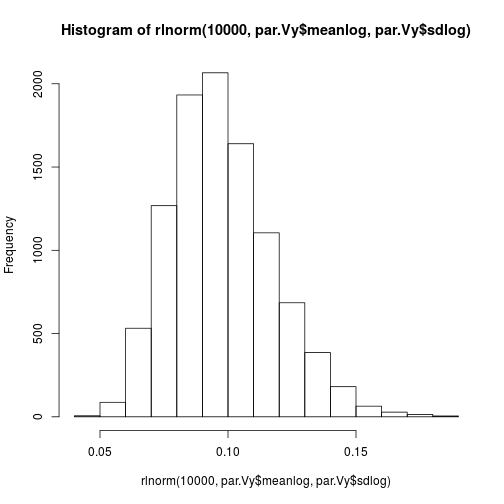

```r
priorBB <- make.prior(tree, 
                     dists=list(dhalflife="dlnorm", dVy="dlnorm", 
                                dk="cdpois", dsb="dsb", dtheta="dnorm"),
                     param=list(dhalflife=par.halflife,
                                dVy=par.Vy,
                                dk=list(lambda=15, kmax=200), dsb=list(bmax=1, prob=1), 
                                dtheta=list(mean=mean(dat), sd=1.5*sd(dat))),
                     model="OUrepar"
)
```

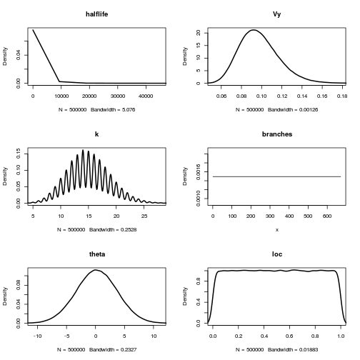


We then run everything as we did before.


```r
startparsBB <- priorSim(priorBB, tree, plot=TRUE)$pars[[1]]
```

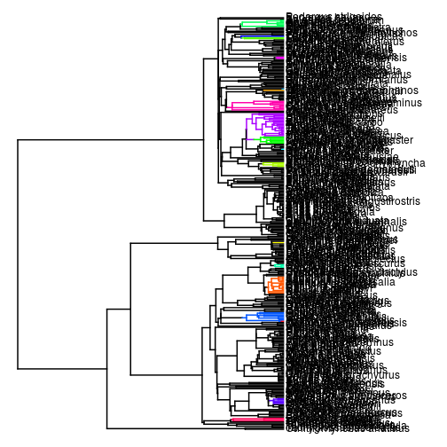

```r
priorBB(startparsBB)
```

```
## [1] -135.101
```

Now that we have a prior function, let's build an MCMC object that will help us run our analyses. 

```r
set.seed(1)
mcmcBB <- bayou.makeMCMC(tree, dat, SE=ME, model="OUrepar", prior=priorBB, new.dir="../output/runs/modelBB/", outname="modelBB_r001", plot.freq=NULL)
mcmcBB$run(10000)
```

```
## gen     lnL     prior   halflif Vy      rtheta  k       birth.k D0.slid D1.slid death.k .halfli .theta  U0.slid U1.slid U2.slid .Vy     
## 1000    -552.46 -196.92 34.19   1.59    0.78    12      0.03    0.88    0.36    1.00    0.25    0.80    0.85    0.78    0.43    0.28    
## 2000    -527.09 -227.96 27.96   1.60    0.05    17      0.03    0.94    0.48    0.82    0.27    1.00    0.82    0.84    0.42    0.37    0.23    
## 3000    -510.08 -211.43 20.78   1.27    -0.41   17      0.02    0.90    0.41    0.78    0.28    1.00    0.78    0.84    0.26    0.28    0.22    
## 4000    -507.19 -203.68 12.77   0.91    -0.50   19      0.02    0.92    0.40    0.70    0.28    1.00    0.76    0.88    0.19    0.23    0.21    
## 5000    -494.57 -189.08 17.43   1.06    -0.15   15      0.02    0.92    0.42    0.62    0.29    1.00    0.73    0.89    0.15    0.20    0.20    
## 6000    -499.78 -181.95 17.66   0.94    -0.26   15      0.02    0.93    0.39    0.55    0.29    1.00    0.72    0.88    0.13    0.18    0.20    
## 7000    -502.71 -190.28 22.74   0.94    -0.21   16      0.01    0.93    0.36    0.51    0.29    1.00    0.72    0.88    0.11    0.16    0.21    
## 8000    -495.50 -181.24 23.45   1.11    -0.31   13      0.01    0.91    0.34    0.49    0.29    1.00    0.72    0.87    0.10    0.13    0.21    
## 9000    -490.63 -191.57 18.83   0.99    -0.30   16      0.01    0.92    0.33    0.45    0.29    1.00    0.71    0.88    0.09    0.13    0.21    
## 10000   -486.83 -200.10 16.51   0.94    -0.30   18      0.01    0.93    0.35    0.43    0.29    1.00    0.70    0.88    0.10    0.14    0.21
```

```r
chainBB <- mcmcBB$load()
chainBB <- set.burnin(chainBB, 0.3)
summary(chainBB)
```

```
## bayou MCMC chain: 10000 generations
## 1001 samples, first 300 samples discarded as burnin
```

```
## Warning in rbind(statistics, c(sum.rjpars[[i]]$statistics[1:2], rep(NA, :
## number of columns of result is not a multiple of vector length (arg 2)
```

```
## 
## 
## Summary statistics for parameters:
##                    Mean          SD    Naive SE Time-series SE
## lnL        -494.3768221  7.01558696 0.264786266     2.05431429
## prior      -196.5093913 11.20421122 0.422875702     4.50691783
## halflife     18.3909862  2.63445220 0.099430991     0.52496397
## Vy            1.0425029  0.08856605 0.003342710     0.01984305
## k            16.3048433  1.89630000 0.071571231     0.90350282
## ntheta       17.3048433  1.89630000 0.071571231     0.90350282
## root.theta   -0.2325926  0.14690621 0.005544617     0.05315134
## all theta     0.6960997  3.08945778          NA             NA
##            Effective Size   HPD95Lower    HPD95Upper
## lnL             11.662570 -508.3806252 -482.48060253
## prior            6.180211 -216.9598583 -175.06020835
## halflife        25.183823   14.1019596   23.60165231
## Vy              19.921302    0.8914944    1.21157388
## k                4.405093   13.0000000   20.00000000
## ntheta           4.405093   14.0000000   21.00000000
## root.theta       7.639269   -0.5096434   -0.01490984
## all theta              NA    0.6960997    3.08945778
## 
## 
## Branches with posterior probabilities higher than 0.1:
##            pp magnitude.of.theta2 naive.SE.of.theta2 rel.location
## 148 1.0000000           1.2578623        0.021472565 4.672740e-02
## 388 1.0000000           2.3636107        0.019430115 8.986194e-01
## 577 1.0000000          -3.8356362        0.070434899 2.182879e-02
## 637 1.0000000           4.1799902        0.009112012 5.934092e-01
## 638 1.0000000           5.1384671        0.026941557 3.304781e+00
## 663 0.9914530           2.2748041        0.041316954 6.370773e+00
## 588 0.9287749          -3.7775447        0.040140905 4.436221e-01
## 218 0.8618234          -3.5659725        0.015984692 6.511662e-02
## 662 0.8504274           0.3945784        0.008711278 5.636071e-01
## 275 0.8376068          -1.7422325        0.006709745 5.927459e-03
## 650 0.7279202           5.8181472        0.032701015 1.445466e-01
## 527 0.6139601           3.6728024        0.042879187 6.835522e+01
## 583 0.3874644           2.9351718        0.031812882 8.244416e-01
## 642 0.3347578           2.3477120        0.011279248 2.017379e-01
## 152 0.2891738          -1.2193568        0.056083477 5.736130e-01
## 581 0.2678063           4.5890854        0.093204885 6.928101e+00
## 565 0.2521368           4.9313463        0.043727067 6.267884e-03
## 287 0.2165242           0.4301308        0.101618805 1.642082e-01
## 86  0.1894587           0.4918631        0.017730165 1.292323e+02
## 573 0.1809117          -4.7694457        0.086403641 8.327390e-02
## 151 0.1766382          -1.2927139        0.060539495 3.635682e-01
## 274 0.1623932          -1.6841224        0.023891397 7.220818e-01
## 236 0.1552707           1.7744845        0.035065414 1.274374e+01
## 102 0.1538462          -1.6785775        0.021598691 1.393930e+00
## 661 0.1438746           2.0757642        0.035714012 5.152011e-01
## 30  0.1424501           1.0209145        0.017912925 8.532257e-01
## 40  0.1125356           1.3091584        0.012423515 6.891511e-01
## 49  0.1125356           1.9151113        0.076490815 1.692192e+00
## 41  0.1011396           1.2665042        0.021228918 2.907092e-01
```

```r
plot(chainBB)
```

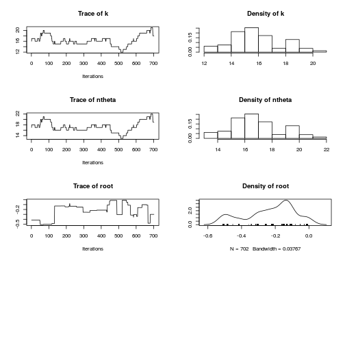


```r
pdf("../output/runs/modelBB/ModelBBHeatMap.pdf", height=20, width=8)
```

```r
#Posterior probabilities proportional to circle diameter:
plotSimmap.mcmc(chainBB, burnin=0.3, cex=0.5)
```

```
## Warning in plotSimmap.mcmc(chainBB, burnin = 0.3, cex = 0.5): Length of
## post-burnin sample less than the requested parameter sample, using entire
## post-burnin chain instead
```

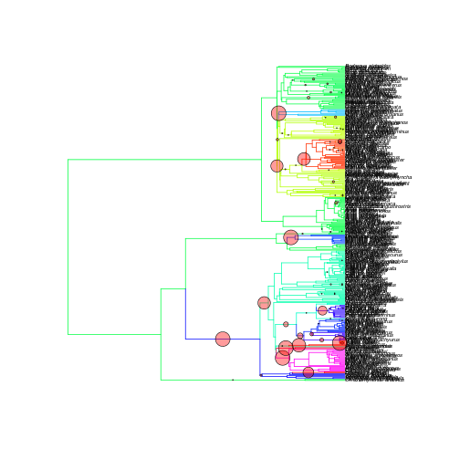

```r
#Branch color proportional to posterior mode value for theta
plotBranchHeatMap(tree, chainBB, variable="theta", burnin=0.3, cex=0.5, lwd=2)
```

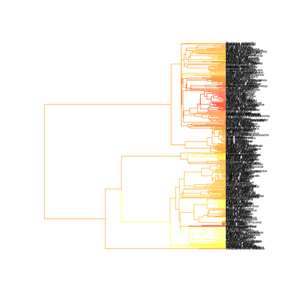

```r
#Phenogram with branches with posterior probabilities > 0.3 colored and a density plot of the posterior of all thetas:
phenogram.density(tree, dat, burnin=0.3, chainBB, pp.cutoff=0.3)
```

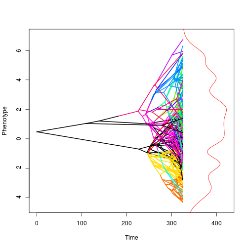

```r
dev.off()
```

## Quantitative Genetics Model
We can also fit a model that follows the Quantitative Genetics parameterization. You can check the specified prior
distributions on your own, but these are informative priors that specify moderate to high heritability, realistic
phenotypic variances, large uncertainty regarding the strength of selection and reasonable effective population 
sizes for entire species. 

```r
par.h2 <- list(shape1=10, shape2=10)
par.P <- list(meanlog=log(0.12), sdlog=0.2)
par.w2 <- list(meanlog=log(100), sdlog=2.5)
par.Ne <- list(meanlog=log(500000), sdlog=2.5)
```

We should rescale the branch lengths to correspond roughly to generation time. However, here we will assume that for
most of the history of birds and mammals, the generation time has been around 2 year/gen.

```r
QGtree <- tree
QGtree$edge.length <- QGtree$edge.length/2

priorQG <- make.prior(QGtree, 
                      dists=list(dh2="dbeta", dP="dlnorm",
                                 dw2="dlnorm", dNe="dlnorm",
                                 dk="cdpois", dtheta="dnorm"),
                      param=list(dh2=par.h2,
                                 dP=par.P,
                                 dw2=par.w2,
                                 dNe=par.Ne,
                                 dk=list(lambda=30, kmax=200), dsb=list(bmax=1, prob=1), 
                                 dtheta=list(mean=mean(dat), sd=1.5*sd(dat))),
                      model="QG"
)
```

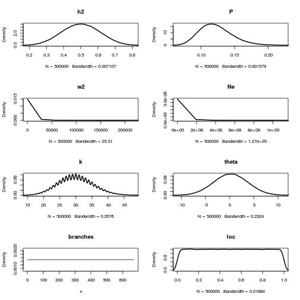

Note that this model has difficulty fitting if the starting point is a poor fit. So rather than drawing from the prior distribution,
we will start with shifts chosen by previous analyses:

```r
endparBB <- pull.pars(length(chainBB$gen), chainBB, mcmcBB$model.pars)
startpars <- priorSim(priorQG, QGtree)$pars[[1]]
```

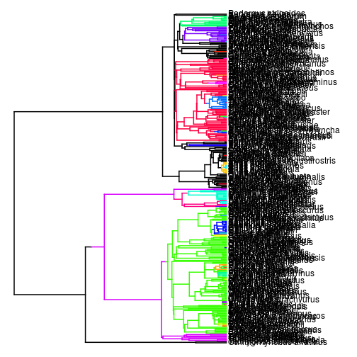

```r
startpars <- c(startpars[1:4], endparBB[3:8])
startpars$loc <- startpars$loc/2

set.seed(100)
mcmcQG <- bayou.makeMCMC(QGtree, dat, SE=ME, model="QG", startpar=startpars, prior=priorQG, new.dir="../output/runs/modelQG/", outname="modelQG_r001", plot.freq=NULL)
mcmcQG$run(10000)
```

```
## gen     lnL     prior   h2      P       w2      Ne      rtheta  k       birth.k D0.slid D1.slid death.k .h2     .Ne     .P      .theta  U0.slid U1.slid U2.slid .w2     
## 1000    -532.05 -435.35 0.72    2.90    2087.93 21.61   0.96    45      0.11    1.00    0.88    0.75    0.16    0.49    0.40    0.83    0.76    0.40    0.58    0.77    
## 2000    -525.28 -228.33 0.80    0.32    46.03   1.95    1.72    29      0.07    1.00    0.83    0.88    0.20    0.36    0.39    0.90    0.89    0.62    0.47    0.76    
## 3000    -528.85 -215.03 0.67    0.17    124.32  1.19    0.45    29      0.06    1.00    0.77    0.90    0.25    0.31    0.32    0.92    0.91    0.67    0.53    0.69    
## 4000    -526.38 -158.51 0.47    0.18    22.69   0.68    0.31    19      0.05    0.98    0.77    0.92    0.25    0.30    0.29    0.93    0.92    0.68    0.51    0.67    
## 5000    -529.27 -146.09 0.45    0.15    55.44   0.55    -0.53   17      0.04    0.96    0.69    0.92    0.25    0.28    0.29    0.92    0.94    0.65    0.57    0.67    
## 6000    -530.46 -135.64 0.33    0.10    121.39  0.29    0.93    15      0.04    0.97    0.70    0.93    0.26    0.27    0.29    0.93    0.95    0.70    0.57    0.68    
## 7000    -530.45 -115.62 0.49    0.11    162.18  0.50    0.71    12      0.03    0.98    0.67    0.94    0.25    0.27    0.29    0.93    0.95    0.68    0.56    0.70    
## 8000    -531.44 -112.25 0.50    0.11    580.39  0.53    1.07    11      0.03    0.97    0.67    0.94    0.25    0.27    0.27    0.94    0.96    0.70    0.59    0.71    
## 9000    -531.62 -109.53 0.54    0.17    289.46  0.87    -0.24   10      0.03    0.98    0.66    0.94    0.24    0.27    0.26    0.94    0.97    0.71    0.63    0.74    
## 10000   -530.32 -112.58 0.58    0.15    69.27   0.70    0.69    11      0.03    0.98    0.66    0.95    0.24    0.26    0.25    0.94    0.97    0.72    0.64    0.74
```

```r
chainQG <- mcmcQG$load()
chainQG <- set.burnin(chainQG, 0.3)
summary(chainQG)
```

```
## bayou MCMC chain: 10000 generations
## 1001 samples, first 300 samples discarded as burnin
```

```
## Warning in rbind(statistics, c(sum.rjpars[[i]]$statistics[1:2], rep(NA, :
## number of columns of result is not a multiple of vector length (arg 2)
```

```
## 
## 
## Summary statistics for parameters:
##                     Mean           SD    Naive SE Time-series SE
## lnL        -529.75850472   2.05482497 0.077554371     1.13650435
## prior      -133.16403861  28.34941540 1.069979733    15.45911566
## h2            0.51049132   0.10314224 0.003892853     0.03400315
## P             0.13456360   0.03067667 0.001157816     0.01743036
## w2          120.25231220 106.73319829 4.028384973    32.91787543
## Ne            0.60173946   0.23075616 0.008709330     0.11687735
## k            14.67094017   4.90639735 0.185180035     2.60911338
## ntheta       15.67094017   4.90639735 0.185180035     2.60911338
## root.theta    0.65075514   0.65107230 0.024573140     0.20012489
## all theta    -0.05767739   2.41563662          NA             NA
##            Effective Size    HPD95Lower   HPD95Upper
## lnL              3.268944 -532.49171959 -524.9582125
## prior            3.362938 -204.62277693 -103.4978430
## h2               9.200996    0.25816671    0.6663179
## P                3.097446    0.09489550    0.1930953
## w2              10.513213   19.04986517  349.1600075
## Ne               3.898037    0.18433312    1.0430682
## k                3.536222   10.00000000   27.0000000
## ntheta           3.536222   11.00000000   28.0000000
## root.theta      10.584156   -0.57879593    1.6783864
## all theta              NA   -0.05767739    2.4156366
## 
## 
## Branches with posterior probabilities higher than 0.1:
##            pp magnitude.of.theta2 naive.SE.of.theta2 rel.location
## 607 0.9729345         -0.32636738         0.04866786 3.360939e-01
## 83  0.5085470         -2.00216764         0.03417874 2.444759e+00
## 338 0.4943020         -1.23411926         0.02822983 3.431769e-01
## 623 0.4786325          0.80073366         0.03751345 3.605698e+00
## 111 0.3974359          1.87561458         0.04537336 5.764869e-01
## 414 0.3732194          1.37988701         0.06434598 1.214060e+01
## 326 0.3219373          1.86667050         0.08974009 3.332000e+00
## 118 0.3105413         -1.44997424         0.05107195 5.623125e-01
## 636 0.3005698          4.29064042         0.08422988 2.360095e+00
## 541 0.2905983          1.72545490         0.03732998 6.094247e-01
## 581 0.2891738         -0.39667884         0.06386487 5.339380e+00
## 663 0.2834758         -0.10589046         0.06080805 9.127447e+00
## 117 0.2806268         -1.85987843         0.04802626 1.453911e-01
## 274 0.2678063         -0.31049831         0.03414482 5.721098e-01
## 314 0.2592593         -1.59685111         0.05221489 1.454942e-01
## 67  0.2492877          1.07367714         0.09547935 8.632337e-01
## 475 0.2293447         -0.05387716         0.07995467 1.066659e+01
## 119 0.2264957         -2.31572532         0.18020462 5.529247e-01
## 327 0.2222222          1.07350261         0.14037013 2.405762e-01
## 527 0.2207977          3.74746070         0.03734913 8.969793e+01
## 65  0.2179487         -0.31949195         0.04967884 8.069633e-01
## 545 0.2179487         -1.07735731         0.10849647 1.195414e-03
## 129 0.2065527         -5.85288977         0.01788142 1.279863e+01
## 275 0.1908832         -1.18649630         0.07489283 1.520520e-02
## 220 0.1894587         -4.00844949         0.04727614 2.040888e-01
## 219 0.1723647         -3.78165048         0.09233497 2.739154e+00
## 131 0.1666667         -5.69256510         0.02244456 1.127016e+00
## 254 0.1652422         -1.47950445         0.06448081 2.052156e-02
## 139 0.1609687         -1.46868210         0.04418685 1.652706e+00
## 553 0.1595442          0.15609879         0.06656345 7.435071e-01
## 563 0.1524217          4.42855676         0.05191368 3.416101e+00
## 246 0.1509972         -4.28588403         0.04564787 2.489594e+00
## 554 0.1424501          1.21540897         0.03590014 2.861928e-01
## 637 0.1396011          4.30114499         0.03596309 2.129500e-01
## 52  0.1367521          4.35395985         0.03446469 2.893051e-02
## 182 0.1353276         -0.95742759         0.04646551 1.281267e+00
## 594 0.1253561         -0.12726593         0.05391077 3.719954e-01
## 40  0.1210826          4.80683953         0.05153549 6.119333e-01
## 147 0.1210826         -2.34819173         0.07159510 5.047319e-02
## 156 0.1210826         -2.63719403         0.08954485 2.437168e-01
## 41  0.1139601          4.14736150         0.02304615 6.805598e-01
## 51  0.1139601          0.73750227         0.09928997 3.066102e+00
## 122 0.1139601          2.75939709         0.05735308 2.121317e-01
## 33  0.1125356          3.73034013         0.03780978 4.329692e+16
## 13  0.1096866         -0.88722689         0.03231778 3.580330e-01
## 66  0.1054131         -2.66645867         0.14146004 6.498034e-01
## 49  0.1039886         -0.17222926         0.15582965 1.715168e+00
## 549 0.1025641         -2.11302829         0.04028090 1.462071e+00
## 325 0.1011396         -0.60984410         0.11219692 8.099235e-01
```

```r
plot(chainQG)
```

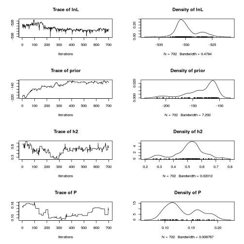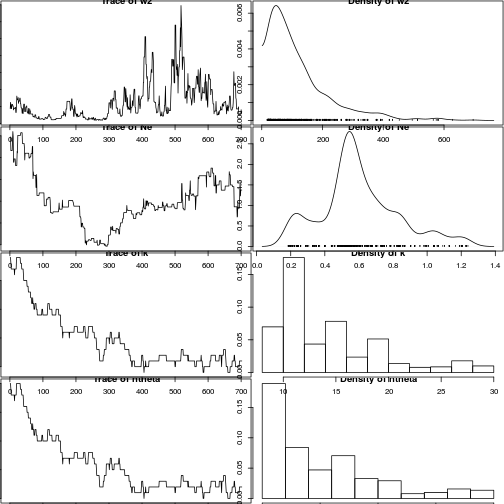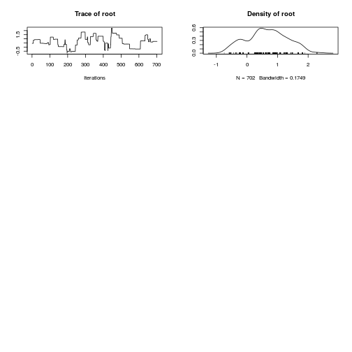


```r
pdf("../output/runs/modelQG/ModelQGHeatMap.pdf", height=20, width=8)
```

```r
#Posterior probabilities proportional to circle diameter:
plotSimmap.mcmc(chainQG, burnin=0.3, cex=0.5)
```

```
## Warning in plotSimmap.mcmc(chainQG, burnin = 0.3, cex = 0.5): Length of
## post-burnin sample less than the requested parameter sample, using entire
## post-burnin chain instead
```

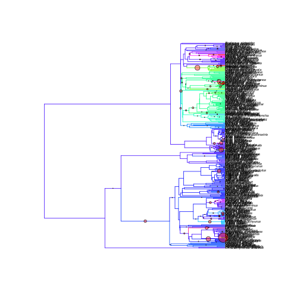

```r
#Branch color proportional to posterior mode value for theta
plotBranchHeatMap(QGtree, chainQG, variable="theta", burnin=0.3, cex=0.5, lwd=2)
```

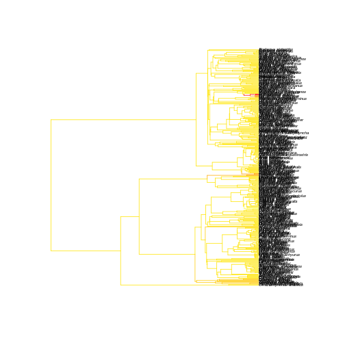

```r
#Phenogram with branches with posterior probabilities > 0.3 colored and a density plot of the posterior of all thetas:
phenogram.density(QGtree, dat, burnin=0.3, chainQG, pp.cutoff=0.3)
```

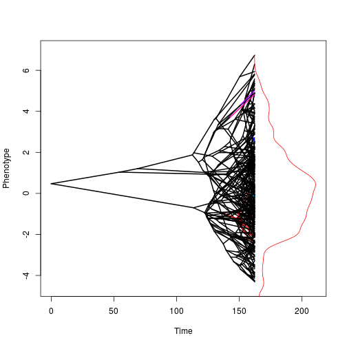

```r
dev.off()
```


# Model Comparison
Alternative parameterizations, shift locations, and priors can be compared using Bayes Factors. This requires estimation 
of the marginal likelihood, which can be difficult. bayou uses stepping-stone sampling to estimate the marginal likelihoods. 
To estimate marginal likelihoods, using the '$steppingstone' function in the mcmc object. For this exercise, we will do a much
shorter run than is recommended. If you have multiple cores available on your machine, you can make use of these to run the
stepping stone analysis in parallel and conduct the analysis much faster. 


```r
library(foreach)
library(doParallel)
registerDoParallel(cores=2)

# Choose the steps from the reference distribution to the posterior distribution, this should be 20-100 steps for a full analysis, 
# but we will use only 5.Note that for each step, an MCMC chain must be run, meaning that this step could take substantially longer
# than the original analysis.

Bk <- qbeta(seq(0,1, length.out=5), 0.3,1)
ssOU <- mcmcOU$steppingstone(10000, chainOU, Bk, burnin=0.3, plot=FALSE)
ssBB <- mcmcBB$steppingstone(10000, chainBB, Bk, burnin=0.3, plot=FALSE)
ssQG <- mcmcQG$steppingstone(10000, chainQG, Bk, burnin=0.3, plot=FALSE)

mlnL <- c("OU"=ssOU$lnr, "BB"=ssBB$lnr, "QG"=ssQG$lnr)
```

# Allometric models
What if there is a known (or unknown) relationship between the trait of interest and another predictor variable? For example,
we may be interested in a relationship between trait known to vary with body size, but consider the possibility that the relationship
with body size itself varies over macroevolutionary time. Here, instead of having a single optimum that changes upon a regime shift,
it is possible to have both the slope and intercept of the relationship change at once. bayou v2.0 allows you to include these additional
predictors and test for shifts in the scaling between a trait and its predictors. 

Well studied allometries such as the relationships between morphological variables (e.g. brain-body size) or metabolic rate and body size
can be studied using this method. But let's do a relationship from the species 360 database that is less explored, the evolution of body 
temperature. 

```r
tdTb <- mutate(td, TbK = BodyTemperature + 273.15, lnGlucose = log(GLUCOSE),
                lnMass = log(Weight_1.82.2yearsage),
                  TbK.SD = BodyTemperature.SD,
                    N = BodyTemperature.N) %>% 
                  dplyr::select(., TbK, TbK.SD, N, lnMass, lnGlucose) %>% filter(., !is.na(TbK), !is.na(lnGlucose), 
                                                                                 is.finite(lnMass), TbK<320, !is.na(lnMass))

tdTb <- mutate(tdTb, ME=ifelse(N==1 | TbK.SD==0, mean(TbK.SD), TbK.SD/sqrt(N)))
tdTb
```

```
## $phy 
## 
## Phylogenetic tree with 204 tips and 203 internal nodes.
## 
## Tip labels:
## 	Ornithorhynchus_anatinus, Tachyglossus_aculeatus, Myrmecophaga_tridactyla, Tamandua_tetradactyla, Choloepus_didactylus, Tolypeutes_matacus, ...
## 
## Rooted; includes branch lengths.
## 
## $dat 
## # A tibble: 204 x 6
##       TbK TbK.SD     N    lnMass lnGlucose        ME
##     <dbl>  <dbl> <int>     <dbl>     <dbl>     <dbl>
## 1  305.15    0.0     1 0.4134333  4.007333 0.9387255
## 2  305.15    0.0     1 1.3840418  4.430817 0.9387255
## 3  306.75    0.9    42 3.8950803  4.234107 0.1388730
## 4  307.55    0.9    30 1.7606127  4.543295 0.1643168
## 5  306.55    1.0    59 1.9942921  4.174387 0.1301889
## 6  306.15    0.7    29 0.2956502  4.262680 0.1299867
## 7  309.75    1.2   106 1.2490418  4.644391 0.1165543
## 8  309.15    0.8     4 6.7344727  4.488636 0.4000000
## 9  309.15    0.0     1 5.9380638  4.454347 0.9387255
## 10 310.45    0.9    64 3.4068481  4.700480 0.1125000
## # ... with 194 more rows
```

```r
#Note, I'm filtering out data with mass missing purely to make the dataset smaller and more tractable, you could
#run this analysis on the full dataset without any problem.

plot(tdTb[['lnGlucose']], tdTb[['TbK']])
```

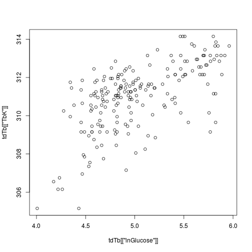
Let's create a separate table for the predictors, and scale them to a common scale. 

```r
tree <- tdTb$phy
dat <- tdTb[['TbK']]
ME <- tdTb[['ME']]
pred <- mutate(tdTb$dat, lnGlu = scale(lnGlucose), lnM = scale(lnMass)) %>%  dplyr::select(., lnGlu, lnM)
lnGlu <- pred[1]
lnM <- pred[2]
```

We are going to test 3 models in this analysis: Global intercepts & slopes (11), Separate intercepts & global slope (N1), and separate
intercepts & slopes (NN).

```r
prior.11 <- make.prior(tree, plot.prior = FALSE, 
                           dists=list(dalpha="dhalfcauchy", dsig2="dhalfcauchy", dbeta_lnGlu="dnorm",
                                      dsb="fixed", dk="fixed", dtheta="dnorm"), 
                           param=list(dbeta_lnGlu=list(mean=0, sd=1),
                                     dtheta=list(mean=mean(dat), sd=1.5*sd(dat))),
                           fixed=list(k=0, sb=numeric(0), loc=numeric(0))
)

prior.N1 <- make.prior(tree, plot.prior = FALSE, 
                       dists=list(dalpha="dhalfcauchy", dsig2="dhalfcauchy", dbeta_lnGlu="dnorm",
                                  dsb="dsb", dk="cdpois", dtheta="dnorm"), 
                       param=list(dbeta_lnGlu=list(mean=0, sd=1),
                                  dk=list(lambda=15, kmax=200),
                                  dsb=list(bmax=1, prob=1),
                                  dtheta=list(mean=mean(dat), sd=1.5*sd(dat)))
)


prior.NN <- make.prior(tree, plot.prior = FALSE, 
                       dists=list(dalpha="dhalfcauchy", dsig2="dhalfcauchy", dbeta_lnGlu="dnorm",
                                  dsb="dsb", dk="cdpois", dtheta="dnorm"), 
                       param=list(dbeta_lnGlu=list(mean=0, sd=1),
                                  dk=list(lambda=15, kmax=200), 
                                  dsb=list(bmax=1, prob=1),
                                  dtheta=list(mean=mean(dat), sd=1.5*sd(dat)))
)

cache <- bayou:::.prepare.ou.univariate(tree, dat, SE=ME, pred=pred)
```
Manually set tuning parameters:

```r
D11 = list(alpha=1, sig2=1, beta_lnGlu=0.5, k=1, theta=0.5, slide=1)
DN1 = list(alpha=1, sig2=1, beta_lnGlu=0.5, k=1, theta=2, slide=1)
DNN = list(alpha=1, sig2=1, beta_lnGlu=1, k=c(1,1), theta=2, slide=1)

set.seed(1)
model.11 <- makeBayouModel(dat ~ lnGlu, rjpars = c(), cache=cache, prior=prior.11, D=D11)
model.N1 <- makeBayouModel(dat ~ lnGlu, rjpars = c("theta"), cache=cache, prior=prior.N1, D=DN1)
model.NN <- makeBayouModel(dat ~ lnGlu, rjpars = c("theta", "lnGlu"), cache=cache, prior=prior.NN, D=DNN)
```

Make MCMC objects:

```r
mcmc.11 <- bayou.makeMCMC(tree, dat, pred=lnGlu, SE=ME, model=model.11$model, prior=prior.11, startpar=model.11$startpar, new.dir="../output/runs/TbK_11/", outname="model11_r001", plot.freq=NULL)
mcmc.N1 <- bayou.makeMCMC(tree, dat, pred=lnGlu, SE=ME, model=model.N1$model, prior=prior.N1, startpar=model.N1$startpar, new.dir="../output/runs/TbK_N1/", outname="modelN1_r001", plot.freq=NULL)
mcmc.NN <- bayou.makeMCMC(tree, dat, pred=lnGlu, SE=ME, model=model.NN$model, prior=prior.NN, startpar=model.NN$startpar, new.dir="../output/runs/TbK_NN/", outname="modelNN_r001", plot.freq=NULL)

mcmc.11$run(10000)
```

```
## gen     lnL     prior   alpha   sig2    beta_ln rtheta  k       .alpha  .beta_l .sig2   .theta  
## 1000    -345.40 -11.28  6.55    19.00   1.12    311.17  0       0.35    0.48    0.31    0.55    
## 2000    -350.13 -10.96  4.24    16.23   0.94    310.87  0       0.40    0.49    0.36    0.53    
## 3000    -345.26 -12.20  12.02   36.73   1.19    311.06  0       0.38    0.51    0.37    0.53    
## 4000    -345.09 -11.57  9.18    26.48   1.05    311.03  0       0.36    0.51    0.36    0.53    
## 5000    -345.56 -14.59  35.86   98.90   1.03    311.13  0       0.35    0.51    0.37    0.53    
## 6000    -345.10 -12.41  14.89   42.15   1.12    311.03  0       0.34    0.52    0.36    0.53    
## 7000    -346.51 -11.72  9.03    28.02   1.14    310.92  0       0.34    0.52    0.34    0.53    
## 8000    -349.27 -10.86  2.97    11.97   1.01    311.18  0       0.35    0.52    0.34    0.53    
## 9000    -345.56 -10.83  1.55    4.55    1.15    310.96  0       0.34    0.52    0.35    0.53    
## 10000   -346.76 -11.54  6.88    24.52   1.15    310.97  0       0.33    0.52    0.35    0.52
```

```r
mcmc.N1$run(10000)
```

```
## gen     lnL     prior   alpha   sig2    beta_ln rtheta  k       .alpha  .beta_l birth.k D0.slid D1.slid death.k .sig2   .theta  U0.slid U1.slid U2.slid 
## 1000    -290.09 -71.97  27.76   46.71   0.77    311.33  8       0.32    0.46    0.01    1.00    0.25    0.62    0.47    0.51    1.00    0.50    0.60    
## 2000    -290.87 -60.43  26.77   43.78   0.79    311.56  6       0.34    0.49    0.00    1.00    0.18    0.54    0.46    0.50    1.00    0.27    0.41    
## 3000    -286.58 -62.39  39.69   65.42   0.74    311.49  6       0.36    0.49    0.00    1.00    0.17    0.50    0.45    0.50    1.00    0.19    0.29    
## 4000    -284.56 -69.27  54.81   89.90   0.92    311.61  7       0.37    0.46    0.00    1.00    0.17    0.47    0.40    0.49    1.00    0.13    0.26    
## 5000    -272.84 -70.64  99.61   132.66  0.82    311.66  7       0.36    0.44    0.01    1.00    0.24    0.46    0.37    0.50    1.00    0.13    0.21    
## 6000    -275.08 -58.37  70.43   98.53   0.95    311.49  5       0.36    0.44    0.01    1.00    0.23    0.38    0.38    0.49    1.00    0.12    0.20    
## 7000    -271.84 -56.50  40.72   49.90   0.87    311.50  5       0.36    0.45    0.00    1.00    0.20    0.36    0.37    0.49    1.00    0.09    0.19    
## 8000    -262.40 -66.16  24.91   24.89   0.90    311.42  7       0.37    0.46    0.01    1.00    0.18    0.34    0.38    0.48    1.00    0.09    0.17    
## 9000    -262.28 -76.42  29.19   25.49   0.93    311.41  9       0.36    0.45    0.01    1.00    0.17    0.32    0.37    0.48    1.00    0.09    0.17    
## 10000   -271.06 -74.60  10.90   11.88   0.86    311.38  9       0.37    0.44    0.01    0.99    0.18    0.33    0.37    0.49    1.00    0.10    0.16
```

```r
mcmc.NN$run(10000)
```

```
## gen     lnL     prior   alpha   sig2    beta_ln rtheta  k       .alpha  .beta_l birth.k D0.slid D1.slid death.k .sig2   .theta  U0.slid U1.slid U2.slid 
## 1000    -279.23 -103.82 262.80  351.23  -0.89   313.08  10      0.36    0.75    0.00    1.00    0.33    1.00    0.49    0.58    1.00    0.75    0.29    
## 2000    -272.00 -87.09  174.94  213.84  0.01    313.75  8       0.38    0.71    0.00    1.00    0.47    0.60    0.00    0.46    0.52    1.00    0.67    0.20    
## 3000    -271.18 -81.28  201.72  225.67  1.35    310.07  7       0.37    0.67    0.00    1.00    0.36    0.50    0.00    0.44    0.48    1.00    0.50    0.13    
## 4000    -272.40 -85.96  74.26   96.16   1.57    310.05  8       0.37    0.66    0.00    1.00    0.29    0.41    0.00    0.41    0.46    1.00    0.42    0.13    
## 5000    -259.74 -96.72  63.07   64.04   1.87    310.10  10      0.36    0.67    0.01    1.00    0.28    0.40    0.00    0.38    0.47    1.00    0.43    0.16    
## 6000    -263.81 -80.90  25.50   35.20   1.53    309.99  8       0.36    0.66    0.00    1.00    0.25    0.37    0.00    0.39    0.46    1.00    0.45    0.14    
## 7000    -263.78 -66.77  33.24   35.87   1.76    309.96  6       0.36    0.65    0.00    1.00    0.24    0.38    0.00    0.39    0.44    1.00    0.43    0.11    
## 8000    -260.38 -65.99  16.81   19.87   1.46    309.77  6       0.37    0.63    0.00    1.00    0.22    0.36    0.00    0.39    0.44    1.00    0.43    0.11    
## 9000    -260.11 -65.40  21.66   20.89   1.58    309.94  6       0.37    0.63    0.00    1.00    0.21    0.33    0.00    0.38    0.43    1.00    0.39    0.10    
## 10000   -260.51 -66.87  28.24   31.20   1.36    309.85  6       0.36    0.62    0.00    1.00    0.18    0.31    0.00    0.39    0.41    1.00    0.33    0.09
```

```r
chain.11 <- mcmc.11$load()
chain.N1 <- mcmc.N1$load()
chain.NN <- mcmc.NN$load()

chain.11 <- set.burnin(chain.11, 0.3)
chain.N1 <- set.burnin(chain.N1, 0.3)
chain.NN <- set.burnin(chain.NN, 0.3)
plot(chain.N1)
```

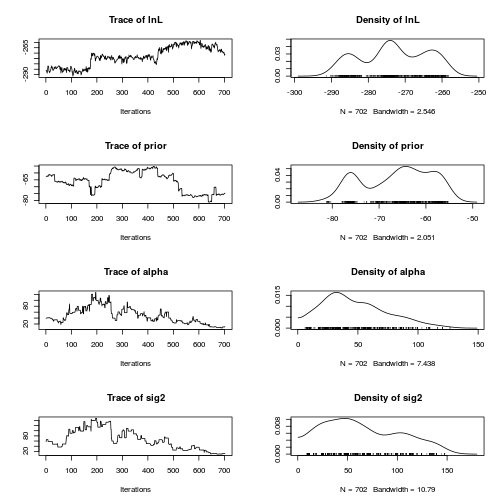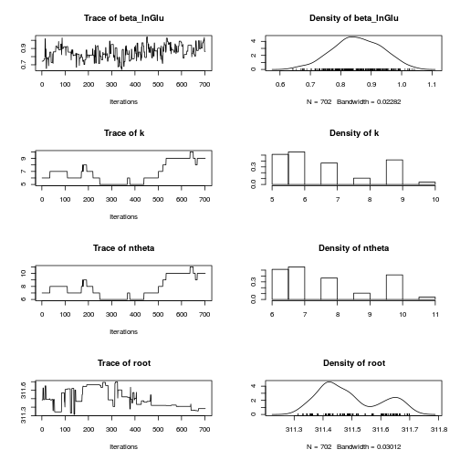

```r
summary(chain.N1)
```

```
## bayou MCMC chain: 10000 generations
## 1001 samples, first 300 samples discarded as burnin
```

```
## Warning in rbind(statistics, c(sum.rjpars[[i]]$statistics[1:2], rep(NA, :
## number of columns of result is not a multiple of vector length (arg 2)
```

```
## 
## 
## Summary statistics for parameters:
##                    Mean          SD    Naive SE Time-series SE
## lnL        -273.2037183  8.90952387 0.336268309    6.540997400
## prior       -66.2740356  7.17565710 0.270827725    4.159965117
## alpha        47.7462454 26.54368189 1.001826714   12.571437694
## sig2         64.8508642 37.74674734 1.424659171   18.245609309
## beta_lnGlu    0.8540921  0.07983316 0.003013108    0.009693164
## k             6.7421652  1.52034792 0.057381834    1.002151876
## ntheta        7.7421652  1.52034792 0.057381834    1.002151876
## root.theta  311.4920183  0.10540348 0.003978198    0.036670557
## all theta   309.7269909  1.72540774          NA             NA
##            Effective Size  HPD95Lower   HPD95Upper
## lnL              1.855329 -287.599973 -259.1074367
## prior            2.975391  -77.215631  -55.8054286
## alpha            4.458127    7.731938   99.6100147
## sig2             4.279986    9.490945  134.4947585
## beta_lnGlu      67.832139    0.689994    0.9952919
## k                2.301542    5.000000    9.0000000
## ntheta           2.301542    6.000000   10.0000000
## root.theta       8.261804  311.344212  311.6647176
## all theta              NA  309.726991    1.7254077
## 
## 
## Branches with posterior probabilities higher than 0.1:
##            pp magnitude.of.theta2 naive.SE.of.theta2 rel.location
## 395 1.0000000            308.2114        0.016130180   0.27231803
## 400 1.0000000            309.4691        0.009356075   1.00196587
## 403 1.0000000            307.2937        0.028162053  24.87475842
## 243 0.7521368            309.9237        0.010300628   0.05984296
## 212 0.5954416            308.0822        0.025505725   1.14405920
## 213 0.4045584            308.8054        0.022104689  15.31619403
## 359 0.3148148            312.5572        0.014863175   0.02681052
## 233 0.2649573            309.9401        0.025891527   5.10904823
## 92  0.2122507            311.4678        0.021182486   0.13037135
## 45  0.1994302            311.5790        0.083311633   6.36993011
## 337 0.1182336            311.7084        0.026591777   0.18962237
```


```r
pdf("../output/runs/TbK_N1/ShiftSummaries_N1.pdf", height=8, width=8)
```

```r
shiftsumsN1 <- shiftSummaries(chain.N1, mcmc.N1, pp.cutoff=0.5)
plotShiftSummaries(shiftsumsN1, lwd=2)
```

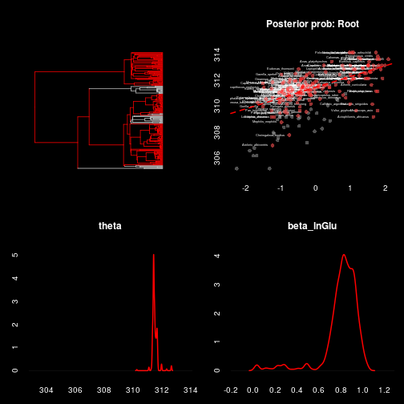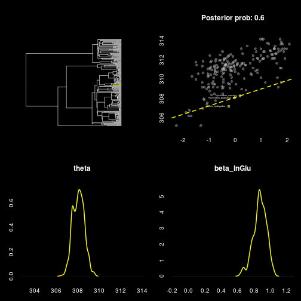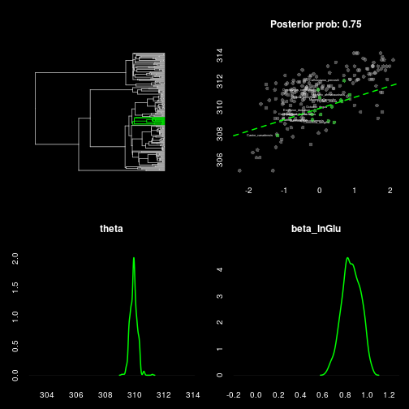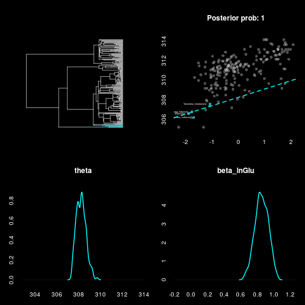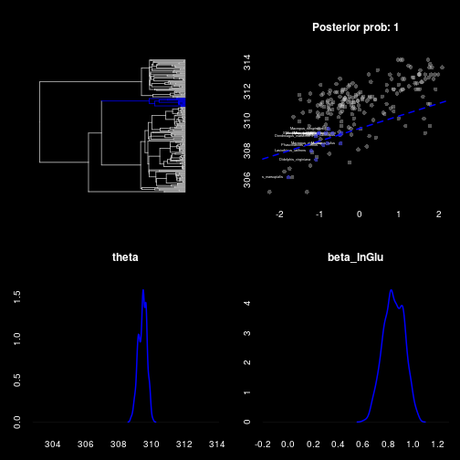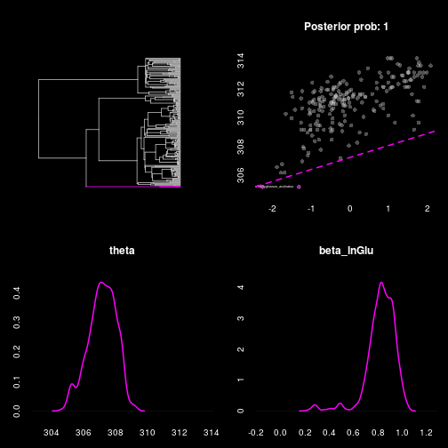

```r
dev.off()
```


```r
pdf("../output/runs/TbK_NN/ShiftSummaries_NN.pdf", height=8, width=8)
```

```r
shiftsumsNN <- shiftSummaries(chain.NN, mcmc.NN, pp.cutoff=0.5)
plotShiftSummaries(shiftsumsNN, lwd=2)
```

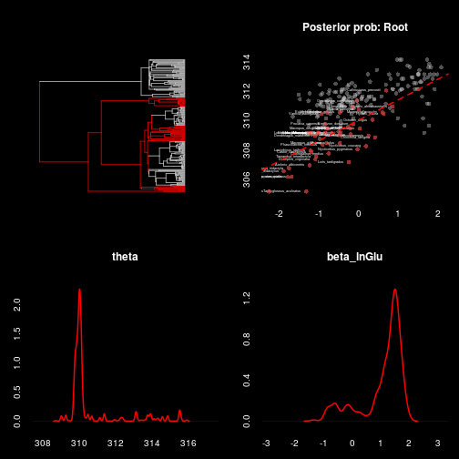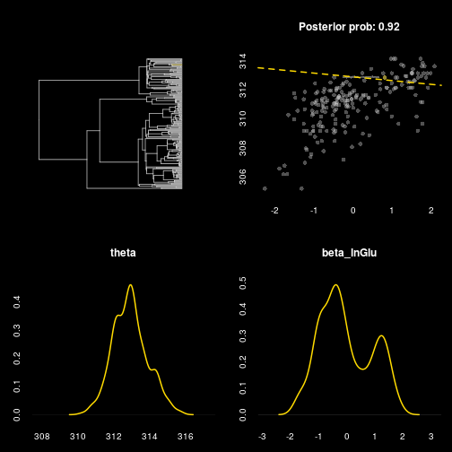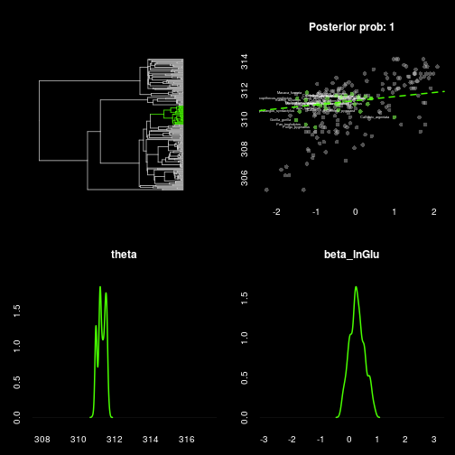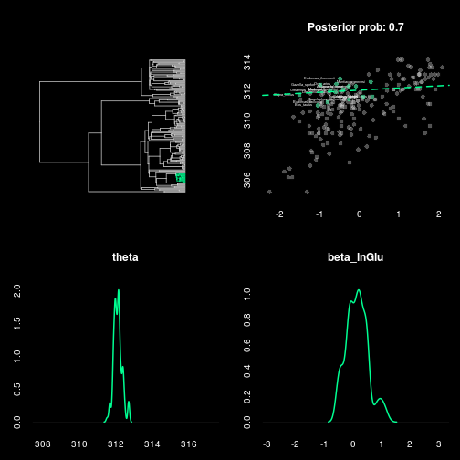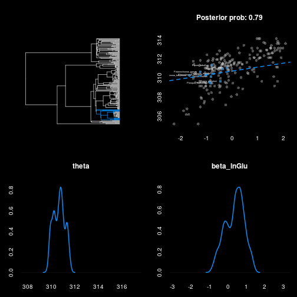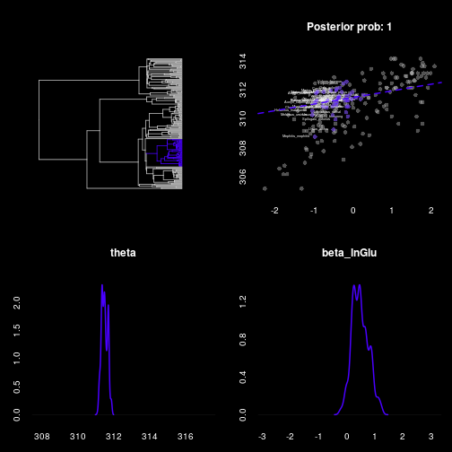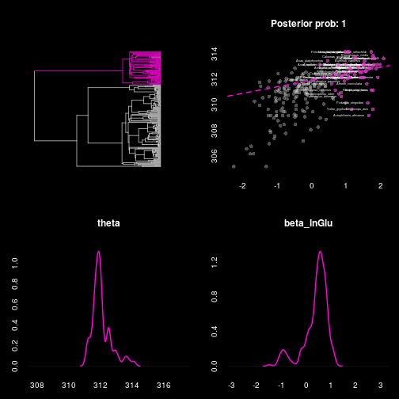

```r
dev.off()
```

We can do model comparison as well with allometric models. Often, these reversible jump models 
can be hard to get to converge. It may be wise to fix the shifts with high posterior probabilities and do model
selection on these models, rather than doing the fully reversible-jump analysis.


```r
# Choose the steps from the reference distribution to the posterior distribution, this should be 20-100 steps for a full analysis, 
# but we will use only 5.Note that for each step, an MCMC chain must be run, meaning that this step could take substantially longer
# than the original analysis.
Bk <- qbeta(seq(0,1, length.out=5), 0.3,1)
registerDoParallel(cores=2)
set.seed(1)
ss.11 <- mcmc.11$steppingstone(10000, chain.11, Bk, burnin=0.3)
```

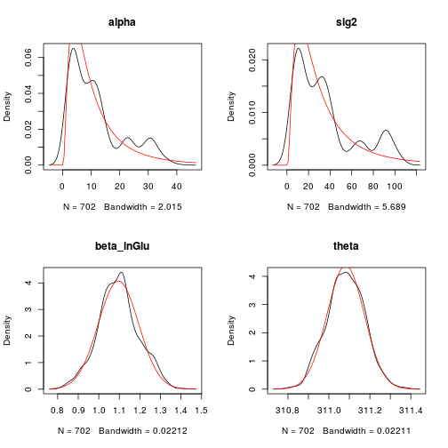

```r
ss.N1 <- mcmc.N1$steppingstone(10000, chain.N1, Bk, burnin=0.3)
ss.NN <- mcmc.NN$steppingstone(10000, chain.NN, Bk, burnin=0.3)
```

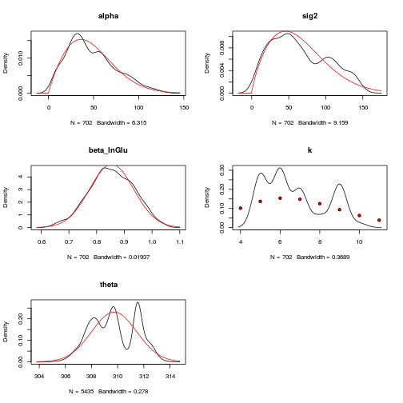

```r
ss.TbK <- list(ss.11, ss.N1, ss.NN)
sapply(ss.TbK, function(x) x$lnr)
```

```
## [1] -354.5425 -334.7981 -314.9937
```

```r
sapply(ss.TbK, plot)
```

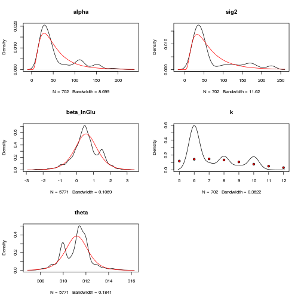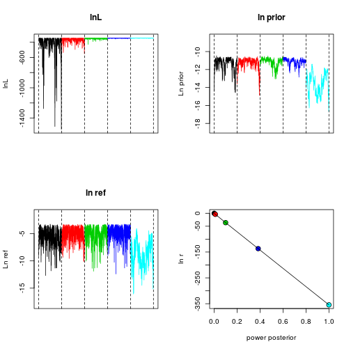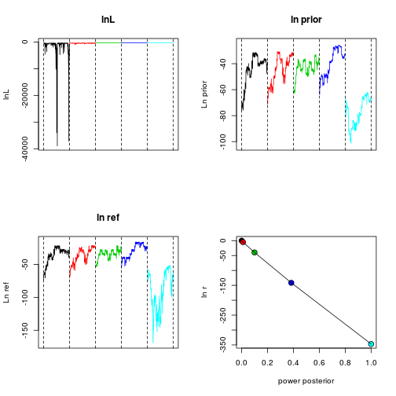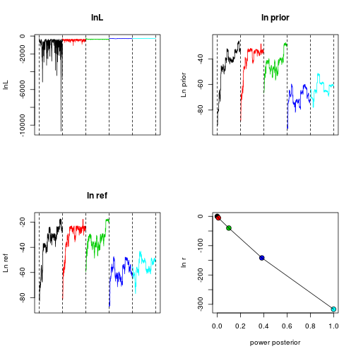

```
## [[1]]
## NULL
## 
## [[2]]
## NULL
## 
## [[3]]
## NULL
```

