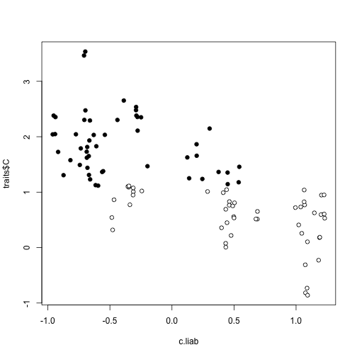

# Threshold models

# PHYLIP & RPhylip
Follow the directions to install phylip and Rphylip. 

```r
#+echo=FALSE
setwd("~/repos/threshold/R/")
library(geiger)
```

```
## Warning: package 'geiger' was built under R version 3.2.2
```

```
## Loading required package: ape
```

```
## Warning: package 'ape' was built under R version 3.2.5
```

```r
library(phytools)
```

```
## Warning: package 'phytools' was built under R version 3.2.5
```

```
## Loading required package: maps
```

```
## Warning: package 'maps' was built under R version 3.2.3
```

```
## 
##  # maps v3.1: updated 'world': all lakes moved to separate new #
##  # 'lakes' database. Type '?world' or 'news(package="maps")'.  #
```

```r
library(MCMCglmmRAM)
```

```
## Loading required package: Matrix
## 
## Attaching package: 'Matrix'
## 
## The following object is masked from 'package:phytools':
## 
##     expm
## 
## Loading required package: coda
```

```
## Warning: package 'coda' was built under R version 3.2.3
```

```r
library(coda)
library(treeplyr)
```

```
## Warning: package 'treeplyr' was built under R version 3.2.5
```

```
## Loading required package: dplyr
```

```
## Warning: package 'dplyr' was built under R version 3.2.5
```

```
## 
## Attaching package: 'dplyr'
## 
## The following objects are masked from 'package:stats':
## 
##     filter, lag
## 
## The following objects are masked from 'package:base':
## 
##     intersect, setdiff, setequal, union
## 
## 
## Attaching package: 'treeplyr'
## 
## The following object is masked from 'package:stats':
## 
##     reorder
```

Let's start by simulating data under multivariate Brownian Motion with a known covariance structure.

```r
# Simulate the tree
ntaxa <- 100
set.seed(1)
tree <- sim.bdtree(b=1, stop="taxa", n=ntaxa)
tree$edge.length <- tree$edge.length/max(branching.times(tree))

# Set up the covariance matrix for changes in the underlying liabilities
R <- matrix(c(  1,   0.7, -0.9,
                0.7,     1, -0.4,
                -0.9,   -0.4,   1), ncol=3, nrow=3, byrow=TRUE)
colnames(R) <- rownames(R) <- c("A", "B", "C")
# Simulate the data using 'sim.char()'. 
dat <- sim.char(tree, par=R, nsim=1, model="BM")[,,1]
colnames(dat) <- c("A", "B", "C")
pairs(dat)
```

 

Match the tree and to the liabilities and create discretized variables. 

```r
td <- make.treedata(tree, dat)

td <- mutate(td, a = as.numeric(A > median(A)), b = as.numeric(B > median(B)), c = as.numeric(C > median(C)))
tree <- td$phy
traits <- as.data.frame(td$dat)
rownames(traits) <- td$phy$tip.label
```

Plot out the discrete traits

```r
par(mfrow=c(1,1))
plot(tree, show.tip.label=FALSE)
tiplabels(pch=22, bg=traits[['a']])
tiplabels(pch=22, bg=traits[['b']], adj=c(0.53,0.5))
tiplabels(pch=22, bg=traits[['c']], adj=c(0.56,0.5))
```

 

# MCMCglmmRAM

```r
library(MCMCglmmRAM)
traits$animal <- factor(tree$tip.label)
prior1 <- list(R=list(V=diag(2)*1e-15, fix=1), G=list(G1=list(V=diag(2), nu=0.002)))
mglmm.AC <- MCMCglmm(cbind(C, A)~trait-1, random=~us(trait):animal, rcov=~us(trait):units,
                     pedigree=tree, reduced=TRUE, data=traits, prior=prior1, 
                     pr=TRUE, pl=TRUE, family=c("gaussian", "gaussian"), thin=1)
```

```
## 
##                       MCMC iteration = 0
## 
##                       MCMC iteration = 1000
## 
##                       MCMC iteration = 2000
## 
##                       MCMC iteration = 3000
## 
##                       MCMC iteration = 4000
## 
##                       MCMC iteration = 5000
## 
##                       MCMC iteration = 6000
## 
##                       MCMC iteration = 7000
## 
##                       MCMC iteration = 8000
## 
##                       MCMC iteration = 9000
## 
##                       MCMC iteration = 10000
## 
##                       MCMC iteration = 11000
## 
##                       MCMC iteration = 12000
## 
##                       MCMC iteration = 13000
```

```r
summary(mglmm.AC)
```

```
## 
##  Iterations = 3001:13000
##  Thinning interval  = 1
##  Sample size  = 10000 
## 
##  DIC: 239.9321 
## 
##  G-structure:  ~us(trait):animal
## 
##                      post.mean l-95% CI u-95% CI eff.samp
## traitC:traitC.animal     1.149   0.8482   1.4923     3315
## traitA:traitC.animal    -1.045  -1.3540  -0.7353     3316
## traitC:traitA.animal    -1.045  -1.3540  -0.7353     3316
## traitA:traitA.animal     1.144   0.8423   1.4889     3317
## 
##  R-structure:  ~us(trait):units
## 
##                     post.mean l-95% CI u-95% CI eff.samp
## traitC:traitC.units     1.149   0.8482   1.4923     3315
## traitA:traitC.units    -1.045  -1.3540  -0.7353     3316
## traitC:traitA.units    -1.045  -1.3540  -0.7353     3316
## traitA:traitA.units     1.144   0.8423   1.4889     3317
## 
##  Location effects: cbind(C, A) ~ trait - 1 
## 
##        post.mean l-95% CI u-95% CI eff.samp  pMCMC   
## traitC    1.2346   0.4067   2.0740    10000 0.0032 **
## traitA    0.2359  -0.5564   1.0942    10000 0.5742   
## ---
## Signif. codes:  0 '***' 0.001 '**' 0.01 '*' 0.05 '.' 0.1 ' ' 1
```

```r
plot(mglmm.AC)
```

   

```r
prior2 <- list(R=list(V=diag(2)*1e-15, fix=1), G=list(G1=list(V=diag(2), nu=0.002, fix=2)))
mglmm.aC <- MCMCglmm(cbind(C, a)~trait-1, random=~us(trait):animal, rcov=~us(trait):units,
                  pedigree=tree, reduced=TRUE, data=traits, prior=prior2, 
                    pr=TRUE, pl=TRUE, family=c("gaussian", "threshold"), thin=1)
```

```
## 
##                       MCMC iteration = 0
## 
##                       MCMC iteration = 1000
## 
##                       MCMC iteration = 2000
## 
##                       MCMC iteration = 3000
## 
##                       MCMC iteration = 4000
## 
##                       MCMC iteration = 5000
## 
##                       MCMC iteration = 6000
## 
##                       MCMC iteration = 7000
## 
##                       MCMC iteration = 8000
## 
##                       MCMC iteration = 9000
## 
##                       MCMC iteration = 10000
## 
##                       MCMC iteration = 11000
## 
##                       MCMC iteration = 12000
## 
##                       MCMC iteration = 13000
```

```r
summary(mglmm.aC)
```

```
## 
##  Iterations = 3001:13000
##  Thinning interval  = 1
##  Sample size  = 10000 
## 
##  DIC: 247.8767 
## 
##  G-structure:  ~us(trait):animal
## 
##                      post.mean l-95% CI u-95% CI eff.samp
## traitC:traitC.animal    1.1391   0.8531   1.4596    585.9
## traita:traitC.animal   -0.9157  -1.1019  -0.7394    368.9
## traitC:traita.animal   -0.9157  -1.1019  -0.7394    368.9
## traita:traita.animal    1.0000   1.0000   1.0000      0.0
## 
##  R-structure:  ~us(trait):units
## 
##                     post.mean l-95% CI u-95% CI eff.samp
## traitC:traitC.units    1.1391   0.8531   1.4596    585.9
## traita:traitC.units   -0.9157  -1.1019  -0.7394    368.9
## traitC:traita.units   -0.9157  -1.1019  -0.7394    368.9
## traita:traita.units    1.0000   1.0000   1.0000      0.0
## 
##  Location effects: cbind(C, a) ~ trait - 1 
## 
##        post.mean l-95% CI u-95% CI eff.samp  pMCMC   
## traitC    1.2403   0.4112   2.0817     9679 0.0034 **
## traita    0.1585  -0.6286   0.9714     3725 0.6934   
## ---
## Signif. codes:  0 '***' 0.001 '**' 0.01 '*' 0.05 '.' 0.1 ' ' 1
```

```r
plot(mglmm.aC)
```

   

```r
prior3 <- list(R=list(V=diag(2)*1e-15, fix=1), G=list(G1=list(V=diag(2), nu=0.002)))
mglmm.ac <- MCMCglmm(cbind(c, a)~trait-1, random=~corg(trait):animal, rcov=~corg(trait):units,
                     pedigree=tree, reduced=TRUE, data=traits, prior=prior3, 
                     pr=TRUE, pl=TRUE, family=c("threshold", "threshold"), thin=1)
```

```
## 
##                       MCMC iteration = 0
## 
##                       MCMC iteration = 1000
## 
##                       MCMC iteration = 2000
## 
##                       MCMC iteration = 3000
## 
##                       MCMC iteration = 4000
## 
##                       MCMC iteration = 5000
## 
##                       MCMC iteration = 6000
## 
##                       MCMC iteration = 7000
## 
##                       MCMC iteration = 8000
## 
##                       MCMC iteration = 9000
## 
##                       MCMC iteration = 10000
## 
##                       MCMC iteration = 11000
## 
##                       MCMC iteration = 12000
```

```r
summary(mglmm.ac)
```

```
## 
##  Iterations = 3001:13000
##  Thinning interval  = 1
##  Sample size  = 10000 
## 
##  DIC: 
## 
##  G-structure:  ~corg(trait):animal
## 
##                      post.mean l-95% CI u-95% CI eff.samp
## traitc:traitc.animal    1.0000   1.0000   1.0000        0
## traita:traitc.animal   -0.7625  -0.9628  -0.4971      196
## traitc:traita.animal   -0.7625  -0.9628  -0.4971      196
## traita:traita.animal    1.0000   1.0000   1.0000        0
## 
##  R-structure:  ~corg(trait):units
## 
##                     post.mean l-95% CI u-95% CI eff.samp
## traitc:traitc.units    1.0000   1.0000   1.0000        0
## traita:traitc.units   -0.7625  -0.9628  -0.4971      196
## traitc:traita.units   -0.7625  -0.9628  -0.4971      196
## traita:traita.units    1.0000   1.0000   1.0000        0
## 
##  Location effects: cbind(c, a) ~ trait - 1 
## 
##        post.mean l-95% CI u-95% CI eff.samp pMCMC
## traitc   0.05347 -0.75630  0.88725     4206 0.891
## traita   0.12858 -0.64558  0.96934     6144 0.766
```

```r
plot(mglmm.ac)
```

   

```r
prior3 <- list(R=list(V=diag(3)*1e-15, fix=1), G=list(G1=list(V=diag(3), nu=0.002)))
mglmm.abc <- MCMCglmm(cbind(a,b,c)~trait-1, random=~corg(trait):animal, rcov=~corg(trait):units,
                     pedigree=tree, reduced=TRUE, data=traits, prior=prior3, 
                     pr=TRUE, pl=TRUE, family=c("threshold", "threshold", "threshold"), thin=1)
```

```
## 
##                       MCMC iteration = 0
## 
##                       MCMC iteration = 1000
## 
##                       MCMC iteration = 2000
## 
##                       MCMC iteration = 3000
## 
##                       MCMC iteration = 4000
## 
##                       MCMC iteration = 5000
## 
##                       MCMC iteration = 6000
## 
##                       MCMC iteration = 7000
## 
##                       MCMC iteration = 8000
## 
##                       MCMC iteration = 9000
## 
##                       MCMC iteration = 10000
## 
##                       MCMC iteration = 11000
## 
##                       MCMC iteration = 12000
```

```r
summary(mglmm.abc)
```

```
## 
##  Iterations = 3001:13000
##  Thinning interval  = 1
##  Sample size  = 10000 
## 
##  DIC: 
## 
##  G-structure:  ~corg(trait):animal
## 
##                      post.mean l-95% CI u-95% CI eff.samp
## traita:traita.animal    1.0000   1.0000   1.0000     0.00
## traitb:traita.animal    0.8399   0.5615   0.9987    38.77
## traitc:traita.animal   -0.8225  -0.9922  -0.5794    47.87
## traita:traitb.animal    0.8399   0.5615   0.9987    38.77
## traitb:traitb.animal    1.0000   1.0000   1.0000     0.00
## traitc:traitb.animal   -0.5009  -0.9557  -0.0372    32.71
## traita:traitc.animal   -0.8225  -0.9922  -0.5794    47.87
## traitb:traitc.animal   -0.5009  -0.9557  -0.0372    32.71
## traitc:traitc.animal    1.0000   1.0000   1.0000     0.00
## 
##  R-structure:  ~corg(trait):units
## 
##                     post.mean l-95% CI u-95% CI eff.samp
## traita:traita.units    1.0000   1.0000   1.0000     0.00
## traitb:traita.units    0.8399   0.5615   0.9987    38.77
## traitc:traita.units   -0.8225  -0.9922  -0.5794    47.87
## traita:traitb.units    0.8399   0.5615   0.9987    38.77
## traitb:traitb.units    1.0000   1.0000   1.0000     0.00
## traitc:traitb.units   -0.5009  -0.9557  -0.0372    32.71
## traita:traitc.units   -0.8225  -0.9922  -0.5794    47.87
## traitb:traitc.units   -0.5009  -0.9557  -0.0372    32.71
## traitc:traitc.units    1.0000   1.0000   1.0000     0.00
## 
##  Location effects: cbind(a, b, c) ~ trait - 1 
## 
##        post.mean l-95% CI u-95% CI eff.samp pMCMC
## traita   0.15210 -0.64527  0.96733   1767.5 0.714
## traitb   0.23437 -0.59274  1.05311    948.8 0.590
## traitc   0.02447 -0.78190  0.83830   1853.4 0.953
```

```r
plot(mglmm.abc)
```

      

```r
postburnin <- floor(0.3*nrow(mglmm.ac$Liab)):nrow(mglmm.ac$Liab)
a.liab <- apply(mglmm.ac$Liab[postburnin,1:100], 2, mean)
c.liab <- apply(mglmm.ac$Liab[postburnin,101:200], 2, mean)

plot(a.liab, traits$A, pch=21,  bg=traits$a)
```

 

```r
plot(c.liab, traits$C, pch=21,  bg=traits$c)
```

 

Now get the liabilities at the nodes.

```r
a.nodeLiab <- apply(mglmm.ac$Sol[postburnin, 1:tree$Nnode], 2, mean)
```

And we can plot them on the tree:

```r
plot(tree)
a.pie <- (a.nodeLiab-min(a.nodeLiab))/diff(range(a.nodeLiab))
a.pie <- cbind(a.pie, 1-a.pie)
nodelabels(pie=a.pie, piecol = c("white", "black"), cex=0.5)
tiplabels(pch=21, bg = c("white", "black")[traits$a+1])
```

 
